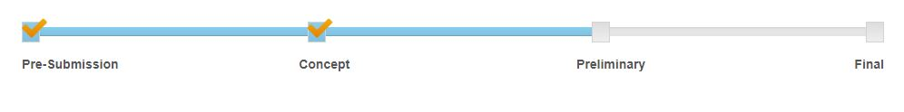

# Milestones
Milestones is a jQuery plugin that displays a timeline with milestones. The milestones are evenly separated along the timeline with labels underneath. Once a milestone is met, you can check it off and move to the next one. 

## Online Demo

+ https://stemo40.github.io/milestones/

## Requirements
Milestones is dependant on three external libraries which are listed below:

+ Bootstrap
+ jQuery
+ Font-Awesome

## Getting Started

### Load Required Stylesheets
$ <link rel="stylesheet" href="https://maxcdn.bootstrapcdn.com/bootstrap/3.3.7/css/bootstrap.min.css">

$ <link rel="stylesheet" href="https://maxcdn.bootstrapcdn.com/font-awesome/4.7.0/css/font-awesome.min.css">

$ <link rel="stylesheet" href="css/milestones.css">

### Load Required Libraries
$ 
$ 
$ 

