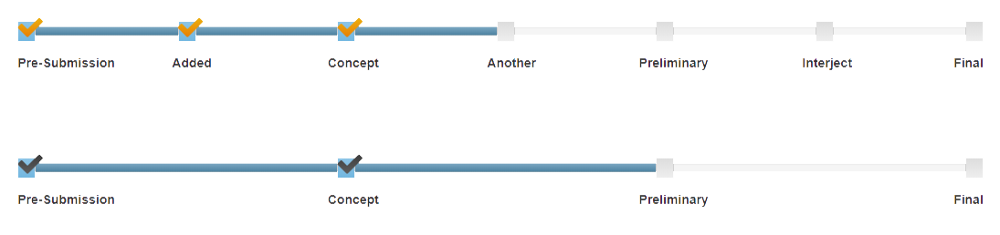

.. Milestones documentation master file, created by
   sphinx-quickstart on Fri Jan 26 18:22:58 2018.
   You can adapt this file completely to your liking, but it should at least
   contain the root `toctree` directive.

######################################
Welcome to Milestones's documentation!
######################################

Milestones is a jQuery plugin that displays a timeline with milestones. The milestones are evenly separated along the timeline with labels underneath. Once a milestone is met, you can check it off and move to the next one. 

Click this link to take you to a demo page that displays the plugin in real time. Be sure to view the source to see how to set it up and options available.

* `Demo <https://stemo40.github.io/milestones/>`_

.. toctree::
   :maxdepth: 4 
   :numbered:
   :caption: Table of Contents

   master
   license
